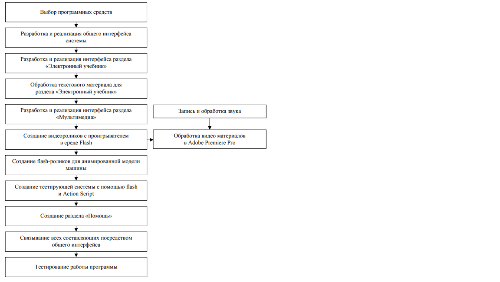

В результате проектирования мультимедийного обучающего комплекса должен быть разработан цельный интерактивный курс, с достаточной полнотой представляющий всю учебную информацию. Принцип интерактивности учебного материала — второй важный принцип, который следует учитывать при разработке электронных средств обучения. Современные программные средства дают возможность интегрировать различные среды представления информации, такие как текст, статическую и динамическую графику, видео- и аудио- записи, в единый комплекс, позволяющий обучаемому стать активным участником учебного процесса, поскольку выдача информации происходит в ответ на его соответствующие действия.
Разработка мультимедийного обучающего тестирующего комплекса состоит из нескольких этапов. Сначала создается непосредственно сам интерфейс программной системы. Для этого используется язык гипертекстовой разметки html и программный пакет Adobe Dreamweaver. Параллельно этому необходимо заполнить программный комплекс необходимой учебной информацией. Затем с помощью программного средства Adobe Flash и языка Action Script разрабатываются анимации для обучающего комплекса. В анимации необходимо внедрить звуковое сопровождение, заранее обработанное, например, при помощи программы Sony Forge Pro [3]. 
Затем, с помощью программы Adobe Premier Pro или подобной создаются видеоролики, позволяющие повысить наглядность мультимедийного комплекса. 
Далее создаются тестовые системы по каждому из изучаемых разделов для контроля знаний. Тесты могут быть созданы при помощи Adobe Flash и Action Script. 
В связи с тем, что разрабатываемая программная система может быть помещена в Интернет, необходимо сделать так, чтобы рисунки и анимации загружались на странице как можно быстрее.
Для этих целей можно использовать Adobe Photoshop. Этот программный пакет позволяет качественно и быстро обрабатывать изображения, а так же имеет важную функцию – Save for Web & Devices. 
Эта функция дает возможность уменьшить «вес» изображения, при этом, не меняя его размеров, а лишь несущественно изменяя его качественно. Благодаря этому загрузка изображений на странице происходит гораздо быстрее. 
Основой создания сетевых электронных средств обучения являются телекоммуникационные технологии, которые используются для доставки учебных материалов или организации контролируемого доступа к ним.

